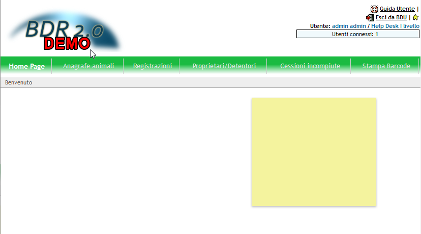
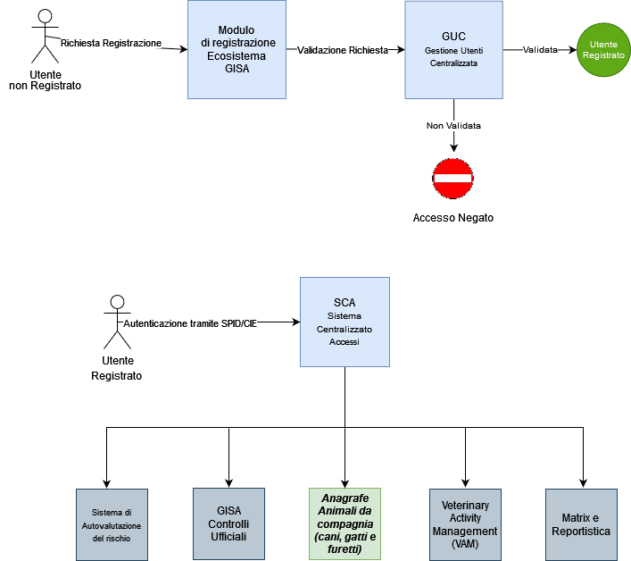
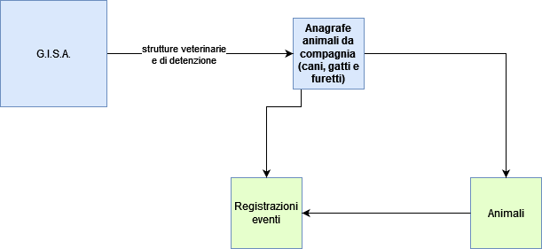

<p align="center">

</p>

# Anagrafe animali da compagnia


- [1. Descrizione e finalità del software](#1-descrizione-e-finalità-del-software)
  - [1.1 Descrizione della struttura repository](#11-descrizione-della-struttura-repository)
  - [1.2 Contesto di utilizzo e casi d’uso](#12-contesto-di-utilizzo-e-casi-duso)
  - [1.3 Piattaforme abilitanti](#13-piattaforme-abilitanti)
  - [1.4 Interoperabilità con i sistemi esterni](#14-interoperabilità-con-i-sistemi-esterni)
  - [1.5 Link a pagine istituzionali relative al progetto](#15-link-a-pagine-istituzionali-relative-al-progetto)
  - [1.6 Interfaccia web](#16-interfaccia-web)
- [2. Architettura del software](#2-architettura-del-software)
  - [2.1 Descrizione delle directory](#21-descrizione-delle-directory)
- [3. Requisiti](#3-requisiti)
  - [3.1 Tecnologie utilizzate lato server](#31-tecnologie-utilizzate-lato-server)
  - [3.2 Tecnologie utilizzate lato client](#32-tecnologie-utilizzate-lato-client)
- [4. Riuso ed installazione](#4-riuso-ed-installazione)
  - [4.1 Build dai sorgenti](#41-build-dai-sorgenti)
  - [4.2 Riuso nell’ambito della stessa regione](#42-riuso-nellambito-della-stessa-regione)
  - [4.3 Riuso per enti di altre regioni](#43-riuso-per-enti-di-altre-regioni)
  - [4.4 Librerie esterne](#44-librerie-esterne)
  - [4.5 Creazione e import database](#45-creazione-e-import-database)
  - [4.6 Templates configurazione](#46-templates-configurazione)
  - [4.7 Installazione in un ambiente di sviluppo](#47-Installazione-in-un-ambiente-di-sviluppo)
  - [4.8 Installazione in un ambiente di produzione](#48-Installazione-in-un-ambiente-di-produzione)
- [5. Configurazione](#5-configurazione)
  - [5.1 Configurazione web.xml](#51-configurazione-webxml)
  - [5.2 Configurazione datasource.xml](#52-configurazione-datasourcexml)
  - [5.3 Configurazione context.xml](#53-configurazione-contextxml)
  - [5.4 Configurazione server.xml](#54-configurazione-serverxml)
  - [5.5 Prima dell'avvio applicativo](#55-prima-dellavvio-applicativo)
- [6. Licenza](#6-licenza)
  - [6.1 Anagrafe animali da compagnia (cani, gatti e furetti)](#61-anagrafe-animali-da-compagnia-cani-gatti-e-furetti)
  - [6.2 Indirizzo e-mail segnalazioni di sicurezza](#62-indirizzo-e-mail-segnalazioni-di-sicurezza)
  - [6.3 Titolarità: Regione Campania](#63-titolarità-regione-campania)
  
  
  
# **1. Descrizione e finalità del software**


***Anagrafe animali da compagnia*** (cani, gatti e furetti) è la soluzione applicativa di livello regionale nata per supportare gli adempimenti 
e le attività svolte dalle AA.SS.LL. e dalle altre autorità competenti nell'ambito della sanità pubblica veterinaria.


Il sistema **Anagrafe animali da compagnia** fa parte dell'Ecosistema GISA.


L’***Ecosistema*** ***GISA*** è composto da diversi componenti tra cui:

- Autenticazione tramite ***SPID/CIE*** 
- ***Gestione Integrata Notifiche Sanitarie***: modulo di gestione delle pratiche di registrazione/riconoscimento degli OSA (Operatore del Settore Alimentare) provenienti dai SUAP con possibilità di alimentazione tramite cooperazione applicativa.
- ***MATRIX***: modulo di gestione della programmazione a livello regionale, con il *Documento di programmazione Annuale Regionale (DPAR)*, e a livello territoriale, con il *Documento di programmazione Annuale Territoriale (DPAT)*. Esso consente di stimare il fabbisogno delle risorse umane necessarie a compiere le attività programmate.
- ***Gestione Controlli Ufficiali***: registrazione di tutti i dati relativi ai controlli ufficiali (tipo AUDIT, Ispezioni Semplici, Ispezioni in Sorveglianza), comprese le non conformità riscontrate, sanzioni amministrative applicate con generazione Avvisi di Pagamento PagoPA, sequestri, notizie di reato, follow up, ecc… con stampa della documentazione ufficiale precompilata (verbale ispezione, verbali di campionamenti, ecc…).
- ***Gestione Allerte Alimentari***: Registrazione di tutti i dati relativi ai controlli ufficiali effettuati per il sistema europeo RASFF (Rapid Alert System Food and Feed).
- ***Registro Trasgressori*** e ***Gestione degli illeciti amministrativi*** e delle ***Ordinanze regionali*** in cooperazione applicativa con PagoPA.
- ***Reportistica Avanzata***: cruscotto per la rendicontazione delle attività programmate con possibilità di verificare il lavoro svolto dalle singole strutture territoriali afferenti ai Dipartimenti di Prevenzione delle AA.SS.LL.
- ***Macellazioni***: modulo di gestione dei dati relativi alle singole sedute di macellazione (controllo documentale, visita *Ante Mortem*, visita *Post Mortem*, libero consumo, ecc…) con possibilità di stampa di documentazione ufficiale (Registro macellazione, articolo 17, modello 10, ecc…).
- Cooperazione Applicativa tra ecosistema ***GISA*** e ***Sistemi Nazionali*** per scambio dati su:
  - dati OSM 
  - dati checklist BA
  - dati scorta farmaci
  - dati anagrafe animali da compagnia 
  - dati checklist biosicurezza
  - dati checklist farmaco-sorveglianza
  - anagrafiche SINTESIS
  - anagrafiche Allevamenti
- ***Sistema di Autovalutazione** **del** **rischio***: modulo software che consente a imprese e operatori del settore alimentare e/o veterinari di migliorare la conduzione della propria attività, sia nelle modalità decisionali che gestionali, acquisendo consapevolezza dei punti di forza e di debolezza relativi alla/e propria/e attività. In particolare, consente di individuare e valutare il proprio livello di rischio rispondendo alle domande di una *check list* che fa parte del Sistema Ufficiale di Valutazione del Rischio delle imprese e che è utilizzata durante i controlli ufficiali delle AA.SS.LL. con riferimento alla propria linea di attività. L’accesso come ospite all’Autovalutazione può essere utile a coloro che hanno intenzione di avvicinarsi alle linee di attività del settore alimentare e/o veterinari e che desiderano conoscere le check list che verranno utilizzate dagli ispettori per i controlli.
- ***Veterinary Activity Management (VAM):*** Sistema per la gestione delle principali funzionalità relative ad ospedali e ambulatori veterinari pubblici della Regione Campania e di tutte le attività prestazionali effettuate su animali d’affezione e sinantropi. Il sistema gestisce il percorso clinico e chirurgico di ogni animale (cane, gatto e sinantropo) e in particolare:
  - Accettazione
  - Trasferimenti
  - Cartelle cliniche
  - Fascicoli sanitari
  - Registro tumori animali
  - Interazione con la Banca Dati Regionale dell’Anagrafe cani, gatti e furetti.
- ***Anagrafe animali da compagnia (cani, gatti e furetti):*** Sistema dotato di:
  - **Accesso libero**
    che consente di verificare la registrazione nell’Anagrafe regionale di un’animale da compagnia identificato con microchip (transponder);
  - **Accesso riservato agli utenti autorizzati e adeguatamente profilati**
    che permette di gestire le informazioni anagrafiche degli animali e dei loro proprietari/detentori e le relative registrazioni.
- ***BDA-R***: Banca dati apistica regionale integrata in cooperazione applicativa con la Banca dati apistica Nazionale ***BDA-N***.
- ***Sicurezza e prevenzione sui luoghi di lavoro:*** componente per la gestione delle notifiche relative ai cantieri e alle imprese in ambito della sicurezza sui luoghi di lavoro.


Figura 1. Schema su Piano Regionale Integrato


L’intero ecosistema prevede diverse tipologie di utenti che possono essere schematizzati nelle seguenti macrocategorie:

- Utenti istituzionali Regionali
- Utenti istituzionali afferenti ai Dipartimenti di Prevenzione delle AA.SS.LL.
- Utenti istituzionali non appartenenti alle AA.SS.LL. : Forze dell’ordine, Esercito, Università, CRIUV, ecc…
- Utenti liberi professionisti: Veterinari Liberi Professionisti o delegati apicoltori, ecc…
- Utenti imprenditori: apicoltori, trasportatori, ecc...
- Privati cittadini: utenti che accedono alla componente di *Autovalutazione*.

Più precisamente le tipologie di utenti che possono registrarsi in GISA sono le seguenti:

- **ASL**
- **Regione**
- **Centri Riferimento Regionali**
- **IZSM**
- **ARPAC**
- **Osservatori Regionali**
- **Forze dell'Ordine (Polizia stradale, Polizia municipale, Carabinieri, NAS, NAC, ICQ, Guardia forestale)**
- **Esercito**
- **Guardie Zoofile Prefettizie**
- **Guardie Zoofile Regionali**
- **Gestori Acque di rete**
- **Apicoltore Autoconsumo**
- **Apicoltore Commerciale**
- **Delegato Apicoltore / Associazione**
- **Gestore Trasporti**
- **Gestore Distributori (erogatori cibi e bevande)**
- **Medico Veterinario libero professionista**
- **Operatore Settore Alimentare per autovalutazione**
- **Direttore Sanitario Canile** 

I Responsabili dei cantieri non necessitano della registrazione all’ecosistema GISA e possono inoltrare la notifica accedendo con SPID/CIE.

Il totale stimato è di circa **11.000** utenti (peraltro in continua crescita) distribuiti variamente sui sottosistemi.

Entro giugno 2022 saranno presenti in G.I.S.A. anche le tipologie di utenti della prevenzione e sicurezza sui luoghi di lavoro di seguito elencati e la gestione del workflow delle ispezioni sui luoghi di lavoro:

- **Profilo Notificatore**
- **Profilo Ispettore SIML**
- **Profilo Ispettore SPSAL**
- **Profilo Direttore SIML**
- **Profilo Direttore SPSAL**
- **Profilo Regione**
- **Profilo Ispettore UPG**
- **Profilo Ispettore non UPG**


Figura 2. Schematizzazione dei moduli dell’Ecosistema G.I.S.A.


<p align="center">

</p>


Figura 3. Registrazione microchip


## **1.1 Descrizione della struttura repository**

  - _./database_   script sql per la creazione della struttura del DB 

  - _./docs_       documentazione varia (cartella contenente file integrati nel readme: immagini, diagrammi, ecc.)  
  
  - _./lib_       librerie esterne (nel caso di librerie di terze parti conformi alla licenza AGPL 3)

  - _./templates_   file template per la configurazione del sistema

  - _./bdu_ext_    sorgenti e struttura di cartelle della piattaforma 

## **1.2 Contesto di utilizzo e casi d’uso**

 Il contesto di utilizzo e casi d'uso del software sono descritti dettagliatamente nella [guida utente](http://col.gisacampania.it:8080/bdu/guida_2016/guida.jsp?link=mycfs)


## **1.3 Piattaforme abilitanti**

Le piattaforme abilitanti sono:
    - **Autenticazione SPID/CIE**

## **1.4 Interoperabilità con i sistemi esterni**

1. SPID / CIE – Regione Campania
 
1. BDN Anagrafe Canina

1. SINAAF

1. ...


La cooperazione applicativa con i sistemi esterni avviene mediante web services di tipo ***SOAP*** e ***REST***.

La cooperazione applicativa interna all’ecosistema ***GISA*** avviene invece mediante ***microservices*** o ***DBI*** (***DataBase Interface***).


## **1.5 Link a pagine istituzionali relative al progetto**

- [sca.gisacampania.it](https://sca.gisacampania.it)

## **1.6 Interfaccia web**

L'Anagrafe animali da compagnia è dotato di un interfaccia web semplice ma molto dettagliata, possiede molte categorie (chiamate anche cavalieri), con i suoi sotto menù, l'interfaccia si presenta in questo modo: 




Figura 4. Home dell'applicativo


# **2. Architettura del software**

L'architettura software cioè l'organizzazione di base del sistema, espressa dalle sue componenti, dalle relazioni tra di loro e con l'ambiente, e i principi che ne guidano il progetto e l'evoluzione è descritto tramite le immagini seguenti:





Figura 5. Organizzazione di base dell'Ecosistema GISA


Rappresentazione del flusso di fruizione: percorso di navigazione e relazioni tra contenuti





Figura 6. Flusso di fruizione


## **2.1 Descrizione delle directory** 

 La struttura sotto la cartella dei file sorgenti _./bdu_ext_ è una struttura tipica di un [app Tomcat](https://docs.oracle.com/cd/E19226-01/820-7627/bnadx/index.html)


# **3. Requisiti**

## **3.1 Tecnologie utilizzate lato server**

 - [CentOS 7](https://www.centos.org/download/)
 - [Apache Tomcat 8.x](https://tomcat.apache.org/download-80.cgi) 
 - [jdk 1.8.x](https://www.oracle.com/it/java/technologies/javase/javase8u211-later-archive-downloads.html)
 - [Postgres  12.x ](https://computingforgeeks.com/how-to-install-postgresql-12-on-centos-7/)
 - [git](https://git-scm.com/downloads)
 - [ant](https://ant.apache.org/bindownload.cgi)
 - Ambiente di sviluppo per compilazione di progetti Java EE (o come si chiamava prima della versione 5,  Java 2 Enterprise Edition o J2EE)
 
## **3.2 Tecnologie utilizzate lato client**

- [Windows](https://www.microsoft.com/it-it/software-download/) (dalla versione 10 in poi)
- [Mozilla Firefox 99.0.1](https://www.mozilla.org/it/firefox/new/) (Browser Certificato)


# **4. Riuso ed installazione**
 
## **4.1 Build dai sorgenti**

Tecnicamente **L' Anagrafe animali da compagnia** è un'applicazione in architettura web sviluppata con la tecnologia _***Java EE***_ secondo il pattern _MVC_ (model view controller).

Come le applicazioni di questo genere **Anagrafe animali da compagnia** è quindi composta da un back-end in funzione di _Model_ (in questo caso l'_RDBMS_ Postgresql) 
una serie di risorse di front-end web (pagine _HTML_, _CSS_, immagini, ecc.) in funzione di _View_
e infine, in funzione di _Controller_, le classi _java_ componenti le _servlet_ in esecuzione sul _servlet container_ (in questo caso Tomcat). 
    
Come risultato del build, tutti i componenti (in formato compilato per le classi java, in formato nativo gli altri elementi) saranno inclusi 
in un unico archivio per il _deploy_ . 

 
## **4.2 Riuso nell’ambito della stessa regione**

Nell’ottica del risparmio e della razionalizzazione delle risorse è opportuno che gli enti che insistono sullo stesso territorio regionale utilizzino la modalità **Multi-Tenant** al fine di installare un unico sistema a livello regionale.


## **4.3 Riuso per enti di altre regioni** 
Al fine di avvalersi dei benefici del riuso così come concepito dal **CAD** si chiede di notificarlo come indicato nel paragrafo 6.3 al fine di evitare sprechi e frammentazioni.

*Nota: Se lo scopo è avviare un processo di sviluppo per modificare la propria versione di Anagrafe animali da compagnia, potrebbe essere il caso di generare prima un proprio fork su GitHub e quindi clonarlo.*

Eseguire il seguente comando:

        git clone \
		  --depth 1  \
		  --filter=blob:none  \
		  --sparse \
		  https://github.com/regcampania/GISA \
		;
		cd GISA
		git sparse-checkout set anagrafe_animali_da_compagnia

Sarà creata la directory anagrafe_animali_da_compagnia. Da qui in avanti si farà riferimento a questa directory chiamandola "directory base".


## **4.4 Librerie esterne**
Come tutte le applicazioni complesse, Anagrafe animali da compagnia utilizza un elevato numero di librerie in buona parte autocontenute a livello di repository, presenti nel file _build_lib.tar_ nella directory _./lib_.


La configurazione di partenza, modificabile agendo a livello del _build.xml_ sulla variabile _tom.dir_  è:

 _tom.dir=/usr/share/tomcat_
 
 Nel caso in cui si utilizzi come nodo di compilazione una macchina su cui è installato anche Tomcat, si consiglia di disaccoppiare espicitamente la directory delle librerie di compilazione (BuildLibDir)  da quella di tomcat (RuntimeLibDir) configurando nel build.xml - ad esempio - una delle seguenti:
 
      tom.dir=/usr/share/tomcat.build
 
 oppure
 
      tom.dir=/opt/tomcat.build
 
Nella nostra directory _tomcat.build_ deve essere importato il file tar _anagrafe_animali_da_compagnia/lib/build_lib.tar_ con il comando:

```
  mv <anagrafe_animali_da_compagnia/lib/build_lib.tar> <BuildLibDir>
```
```
  tar -xvf <BuildLibDir>/build_lib.tar
```
 
 Per aggiungere le librerie mancanti a tomcat, senza sovrascrivere eventuali jar con lo stesso nome già presenti in _tomcat/lib_, eseguire il comando:
 
```
  rsync -a --ignore-existing <BuildLibDir>/lib/* <RuntimeLibDir>/lib
```


## **4.5 Creazione e import database**

Assicurarsi che nel file di configurazione pg_hba.conf sia correttamente configurato l'accesso dell'IP del nodo Tomcat al database: 
```
 host         all         all       <ipapplicativo>       trust
```


Creazione Database e import dello schema tramite i seguenti comandi, con _dbuser_ e _dbhost_ adeguatamente valorizzati:

```
psql -U <dbuser> -h <dbhost> -c "create database bdu"
```

Posizionarsi nella directory _anagrafe_animali_da_compagnia_ ed eseguire il comando:

```
psql -U <dbuser> -h <dbhost> -d bdu < database/bdu_db_dev.sql
```

## **4.6 Templates configurazione**

Sotto la directory _anagrafe_animali_da_compagnia/templates_ sono presenti i file:  
_anagrafe_animali_da_compagnia/templates/application.properties_  
_anagrafe_animali_da_compagnia/templates/application.propertiesCOLLAUDO_
 
che vanno configurati ed inseriti sotto la directory _anagrafe_animali_da_compagnia/bdu_ext/src/org/aspcfs/utils/_ , Nel caso in cui la configurazione del templates viene fatta successivamente alla compilazione, il path corretto è _webapps/bdu_ext/WEB-INF/classes/org/aspcfs/utils/_ 

Sotto la directory _./templates_ è presente il file template _anagrafe_animali_da_compagnia/templates/conf_PEC.xml_ , da configurare ed inserire sotto la directory _anagrafe_animali_da_compagnia/bdu_ext/src/org/aspcfs/modules/richiestecontributi/base/_


## **4.7 Installazione in un ambiente di sviluppo**

- Eclipse Java EE IDE for Web Developers. Version: Mars.2 Release (4.5.2) Disponibile al seguente indirizzo: https://www.eclipse.org/downloads/packages/release/mars/2/eclipse-ide-java-ee-developers

- Spostare la directory _bdu_ext_ nel WorkSpace locale di Eclipse
- Nuovo progetto BDU con Import directory _bdu_ext_
- Import Existing project into Workspace
- Cliccare tasto destro sul progetto bdu_ext e andare su properties
- Andare sul menù Build Path, selezionare add External Jars
- Unzippare il tar sotto la directory _./lib_ e importare le librerie nel progetto
- Andare sul menù Project Facets, spuntare le voci Dynamic Web Module e Java
- Fare export del progetto selezionado la voce Web (War file) e selezionare una destinazione per il file war
-  A compilazione avvenuta, sarà disponibile nella directory scelta il _war_ `bdu_ext.war` pronto per il deploy sotto Tomcat, 
secondo le abituali modalità previste per le _webapps_ da questo application server (copia del _war_ sotto _tomcatDir_/webapps) esecuzione comando

```
chown -R tomcat:tomcat /<tomcatDir> . 
```

-  Successivamente continuare con i passi successivi della procedura di produzione.

## **4.8 Installazione in un ambiente di produzione**


Prerequisiti:

- Clonare il repository Anagrafe animali da compagnia  (Vedi paragrafo: 4.3 Riuso per enti di altre regioni)  :

 git clone \
		  --depth 1  \
		  --filter=blob:none  \
		  --sparse \
		  https://github.com/regcampania/GISA \
		;
		cd GISA
		git sparse-checkout set anagrafe_animali_da_compagnia
		
- Installare le librerie esterne (Vedi paragrafo: Librerie esterne)

- Creare ed importare database (Vedi paragrafo: Creazione e import database )

- Configurare i templates (Vedi paragrafo: Templates configurazione)

Compilazione:

-  All'interno della directory base, eseguire il comando di compilazione `ant build-war`.

-  A compilazione avvenuta, sarà disponibile nella directory base il _war_ `bdu.war` pronto per il deploy sotto Tomcat, secondo le abituali modalità previste per le _webapps_ da questo application server (copia del _war_ sotto _\<tomcatDir\>_/webapps) esecuzione comando:

```
cp bdu.war <tomcatDir>/webapps 
```

```
chown -R <tomcatuser>:<tomcatgroup> /<tomcatDir>
```


# **5. Configurazione**
 
## **5.1 Configurazione web.xml**


in _tomcat/conf/web.xml_

cercare la servlet:

\<servlet-class\>org.apache.jasper.servlet.JspServlet\</servlet-class\>

e aggiungere:

     <init-param><param-name>strictQuoteEscaping</param-name><param-value>false</param-value></init-param>


il risultato finale deve essere simile a questo:


    <servlet>
        <servlet-name>jsp</servlet-name>
        <servlet-class>org.apache.jasper.servlet.JspServlet</servlet-class>

       <init-param><param-name>strictQuoteEscaping</param-name><param-value>false</param-value></init-param>

        <init-param>
            <param-name>fork</param-name>
            <param-value>false</param-value>
        </init-param>
        <init-param>
            <param-name>xpoweredBy</param-name>
            <param-value>false</param-value>
        </init-param>
        <load-on-startup>3</load-on-startup>
    </servlet>


## **5.2 Configurazione datasource.xml**

Creare il file tomcat/conf/bdu-datasource.xml, copiare il contenuto sostituendo _dbhost_ e _dbuser_ con i rispettivi valori. 

```
 <Resource
        type="javax.sql.DataSource"
        name="jdbc/bduM"
        factory="org.apache.tomcat.jdbc.pool.DataSourceFactory"
        driverClassName="org.postgresql.Driver"
        url="jdbc:postgresql://<dbhost>:5432/bdu" 
        username="<dbuser>"
        maxWait="30000"
        maxActive="10"
        minIdle="2"
        maxIdle="3"
        timeBetweenEvictionRunsMillis="15000"
        removeAbandoned="true"
        removeAbandonedTimeout="55"
        logAbandoned="true"
        initialSize="3"
        testOnBorrow="true"
        testOnReturn="false"
        testWhileIdle="true"
        minEvictableIdleTimeMillis="30000"
        validationInterval="30000"
        validationQuery="SELECT 1"
 />
```


 

## **5.3 Configurazione context.xml**
 
  Nel file tomcat/conf/context.xml deve essere inserito nella sezione _Context_:

 ```
 <ResourceLink global="jdbc/bduM" name="jdbc/bduM" type="javax.sql.DataSource"/>
 ```


## **5.4 Configurazione server.xml**

Nel file tomcat/conf/server.xml dopo l'intestazione deve essere inserito:


     <!DOCTYPE server [
     <!ENTITY bdu-datasource SYSTEM "./bdu-datasource.xml">
     ]>

nella sezione _GlobalNamingResources_ aggiungere:


     &bdu-datasource;


nella sezione _Host_ aggiungere il context _bdu_ come da esempio seguente:

\<Host name="localhost"  appBase="webapps"
unpackWARs="true" autoDeploy="false"\>
 .....................
		

```	
      <Context docBase="bdu" path="/bdu" reloadable="false" source="org.eclipse.jst.jee.server:bdu" swallowOutput="true">
          <Parameter name="context_starting" value="bdu" />
      </Context>
      
```
\</Host\>

## **5.5 Prima dell'avvio applicativo**

Una volta completati tutti i passaggi, bisogna ravviare tomcat:
```
systemctl daemon-reload
systemctl restart tomcat

```

Infine aprire Mozilla Firefox, inserire nella barra di ricerca: 

```
<ipserver>:8080/bdu
```


# **6. Licenza**

## 6.1 Anagrafe animali da compagnia (cani, gatti e furetti) 

Stato Software : Stabile

Browser certificato : Mozilla Firefox 99.0.1

**Soggetti incaricati del mantenimento del progetto open source**

U.S. s.r.l. 
## **6.2 Indirizzo e-mail segnalazioni di sicurezza**
Ogni segnalazione di eventuali problemi di sicurezza o bug relativo al software presente in questo repository, va segnalato unicamente tramite e-mail agli indirizzi presente nel file security.txt disponibile a questo [link](http://www.gisacampania.it/.well-known/security.txt)

NOTA: Le segnalazioni non vanno inviate attraverso l’issue tracker pubblico ma devono essere inviate confidenzialmente agli indirizzi e-mail presenti nel security.txt.

Lo strumento issue tracker può essere utilizzato per le richieste di modifiche necessarie per implementare nuove funzionalità.

## **6.3 Titolarità: [Regione Campania](http://www.regione.campania.it/)**
Concesso in licenza a norma di: **AGPL versione 3**;

E' possibile utilizzare l'opera unicamente nel rispetto della Licenza.

Una copia della Licenza è disponibile al seguente indirizzo: <https://www.gnu.org/licenses/agpl-3.0.txt>

**NOTE:**

In caso di riuso, in toto o in parte, dell’ecosistema software G.I.S.A., è necessario notificare l’adozione in riuso tramite l’apertura di un ticket (o analogo meccanismo quale una pull request) in questo repository. Inoltre, al contempo per gli aspetti organizzativi utili a potenziare i benefici derivanti dalla pratica del riuso tra PP.AA., come la partecipazione alla **Cabina di regia** per la condivisione di eventuali modifiche/integrazioni o innovazioni, è necessario darne tempestiva comunicazione alle seguenti e-mail:

[paolo.sarnelli@regione.campania.it]() 

[cinzia.matonti@regione.campania.it]()	

Gli enti che aderiscono al riuso di GISA entreranno a far parte della Cabina di Regia per condividere e partecipare all’evoluzione di GISA insieme alle altre PP.AA.
