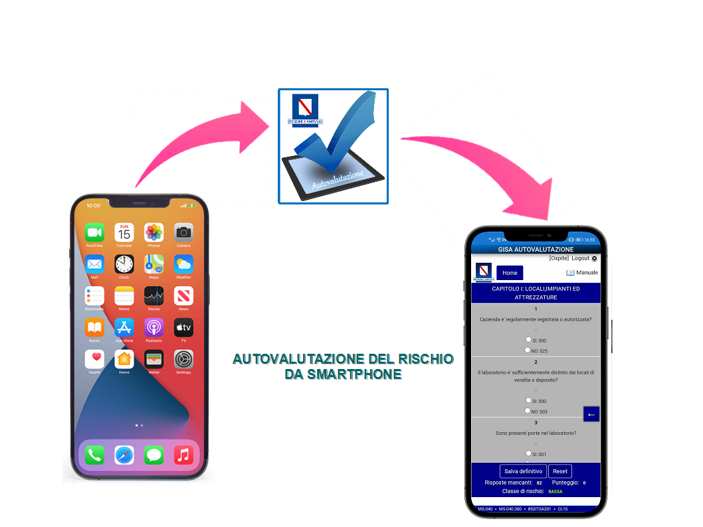
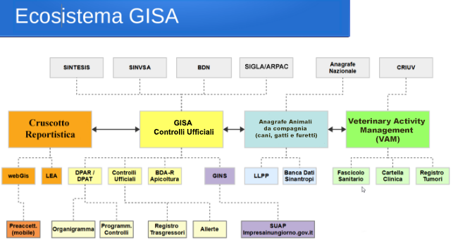
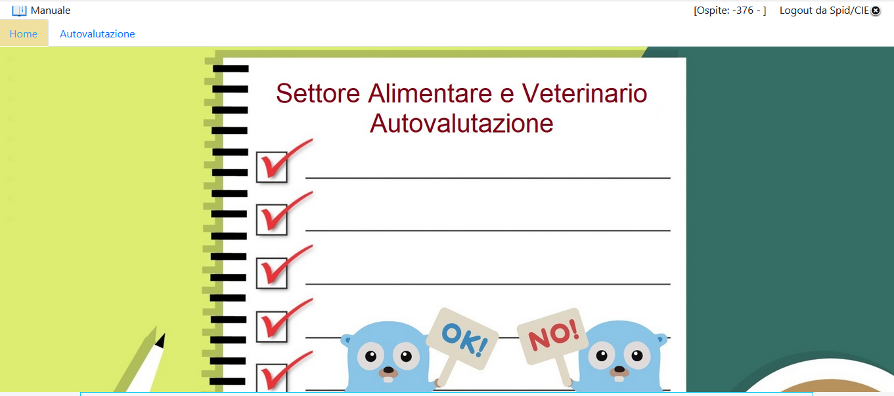
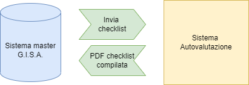
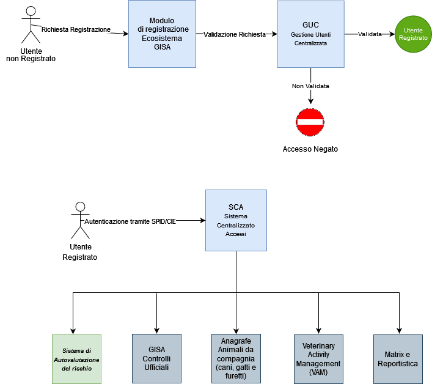

<p align="center">

</p>

# AUTOVALUTAZIONE
- [1. Descrizione e finalità del software](#1-descrizione-e-finalità-del-software)
  - [1.1 Descrizione della struttura repository](#11-descrizione-della-struttura-repository)
  - [1.2 Contesto di utilizzo e casi d’uso](#12-contesto-di-utilizzo-e-casi-duso)
  - [1.3 Piattaforme abilitanti](#13-piattaforme-abilitanti)
  - [1.4 Interoperabilità con i sistemi esterni](#14-interoperabilità-con-i-sistemi-esterni)
  - [1.5 Link a pagine istituzionali relative al progetto](#15-link-a-pagine-istituzionali-relative-al-progetto)
  - [1.6 Interfaccia web](#16-interfaccia-web)
- [2. Architettura del software](#2-architettura-del-software)
- [3. Requisiti](#3-requisiti)
  - [3.1 Tecnologie utilizzate lato server](#31-tecnologie-utilizzate-lato-server)
  - [3.2 Tecnologie utilizzate lato client](#32-tecnologie-utilizzate-lato-client)
- [4. Riuso ed installazione](#4-riuso-ed-installazione)
  - [4.1 Build dai sorgenti](#41-build-dai-sorgenti)
  - [4.2 Riuso nell’ambito della stessa regione](#42-riuso-nellambito-della-stessa-regione)
  - [4.3 Riuso per enti di altre regioni](#43-riuso-per-enti-di-altre-regioni)
  - [4.4 Librerie esterne](#44-librerie-esterne)
  - [4.5 Creazione e import database](#45-creazione-e-import-database)
  - [4.6 Templates configurazione](#46-templates-configurazione)
  - [4.7 Installazione in un ambiente di sviluppo](#47-Installazione-in-un-ambiente-di-sviluppo)
  - [4.8 Installazione in un ambiente di produzione](#48-Installazione-in-un-ambiente-di-produzione)
- [5. Licenza](#5-licenza)
  - [5.1 Autovalutazione](#51-autovalutazione)
  - [5.2 Indirizzo e-mail segnalazioni di sicurezza](#52-indirizzo-e-mail-segnalazioni-di-sicurezza)
  - [5.3 Titolarità: Regione Campania](#53-titolarità-regione-campania)

# **1. Descrizione e finalità del software**

L'**Autovalutazione** per OSA (Operatore del Settore Alimentare) registrati è uno strumento **stand-alone** che la Regione Campania mette a disposizione di imprese e operatori del settore alimentare  e/o veterinario per migliorare 
la conduzione della propria attività, sia nelle modalità decisionali che gestionali, acquisendo consapevolezza dei punti di forza e di debolezza.

In particolare, consente di individuare e valutare il proprio livello di rischio rispondendo alle domande di una check list che fa parte del Sistema
Ufficiale di Valutazione del Rischio delle imprese e che è utilizzata durante i controlli ufficiali delle AA.SS.LL.
con riferimento alla propria linea di attività.
L’accesso come ospite all’Autovalutazione può essere utile a coloro che hanno intenzione di avvicinarsi alle
linee di attività del settore alimentare e/o veterinario e che desiderano conoscere le check list su cui
verrebbero controllati.


<p align="left">

</p>


Figura 1. Autovalutazione del rischio


Questo strumento è stato riconosciuto come **best-practice** dall'**OCSE - Organizzazione per la cooperazione e lo sviluppo economico** ed è innanzitutto, una guida all'autovalutazione, che aiuterà le imprese a osservarsi, monitorarsi e valutarsi dandosi degli obiettivi di miglioramento [(OECD Report)](http://sca.gisacampania.it/qualita_ocse/OECD_report.pdf).


Il sistema è in grado di integrarsi e cooperare con tutti i componenti dell’ecosistema GISA (e non solo). 
Inoltre prevede due livelli di accesso:

  1. **tramite SPID/CIE:** per gli OSA/FBO ovvero coloro che sono già in possesso di una attività

  2. **come ospite:** utile a coloro che hanno intenzione di avvicinarsi alle linee di attività del settore alimentare e/o veterinario e che desiderano conoscere le check list su cui verrebbero controllati.

In entrambi i casi l’utente può compilare e stampare una o più checklist per linea di attività.
Il sistema è conforme al piano di prevenzione nazionale nell’ottica dell’autoconsapevolezza degli OSA.

Il sistema è **multi-browser** e **responsive** quindi in grado di adattarsi graficamente in modo automatico al dispositivo con il quale viene utilizzato
(computer con diverse risoluzioni, tablet, smartphone, ecc), riducendo al minimo la necessità dell'utente di ridimensionare e scorrere i contenuti.





Figura 2. Visualizzazione in versione mobile dell'applicativo


Questo il link diretto al portale:
http://sca.gisacampania.it/autovalutazione/


Il sistema **Autovalutazione** fa parte dell'Ecosistema GISA.


L’***Ecosistema*** ***GISA*** è composto da diversi componenti tra cui:

- Autenticazione tramite ***SPID/CIE*** 
- ***Gestione Integrata Notifiche Sanitarie***: modulo di gestione delle pratiche di registrazione/riconoscimento degli OSA (Operatore del Settore Alimentare) provenienti dai SUAP con possibilità di alimentazione tramite cooperazione applicativa.
- ***MATRIX***: modulo di gestione della programmazione a livello regionale, con il *Documento di programmazione Annuale Regionale (DPAR)*, e a livello territoriale, con il *Documento di programmazione Annuale Territoriale (DPAT)*. Esso consente di stimare il fabbisogno delle risorse umane necessarie a compiere le attività programmate.
- ***Gestione Controlli Ufficiali***: registrazione di tutti i dati relativi ai controlli ufficiali (tipo AUDIT, Ispezioni Semplici, Ispezioni in Sorveglianza), comprese le non conformità riscontrate, sanzioni amministrative applicate con generazione Avvisi di Pagamento PagoPA, sequestri, notizie di reato, follow up, ecc… con stampa della documentazione ufficiale precompilata (verbale ispezione, verbali di campionamenti, ecc…).
- ***Gestione Allerte Alimentari***: Registrazione di tutti i dati relativi ai controlli ufficiali effettuati per il sistema europeo RASFF (Rapid Alert System Food and Feed).
- ***Registro Trasgressori*** e ***Gestione degli illeciti amministrativi*** e delle ***Ordinanze regionali*** in cooperazione applicativa con PagoPA.
- ***Reportistica Avanzata***: cruscotto per la rendicontazione delle attività programmate con possibilità di verificare il lavoro svolto dalle singole strutture territoriali afferenti ai Dipartimenti di Prevenzione delle AA.SS.LL.
- ***Macellazioni***: modulo di gestione dei dati relativi alle singole sedute di macellazione (controllo documentale, visita *Ante Mortem*, visita *Post Mortem*, libero consumo, ecc…) con possibilità di stampa di documentazione ufficiale (Registro macellazione, articolo 17, modello 10, ecc…).
- Cooperazione Applicativa tra ecosistema ***GISA*** e ***Sistemi Nazionali*** per scambio dati su:
  - dati OSM 
  - dati checklist BA
  - dati scorta farmaci
  - dati anagrafe animali da compagnia 
  - dati checklist biosicurezza
  - dati checklist farmaco-sorveglianza
  - anagrafiche SINTESIS
  - anagrafiche Allevamenti
- ***Sistema di Autovalutazione** **del** **rischio***: modulo software che consente a imprese e operatori del settore alimentare e/o veterinari di migliorare la conduzione della propria attività, sia nelle modalità decisionali che gestionali, acquisendo consapevolezza dei punti di forza e di debolezza relativi alla/e propria/e attività. In particolare, consente di individuare e valutare il proprio livello di rischio rispondendo alle domande di una *check list* che fa parte del Sistema Ufficiale di Valutazione del Rischio delle imprese e che è utilizzata durante i controlli ufficiali delle AA.SS.LL. con riferimento alla propria linea di attività. L’accesso come ospite all’Autovalutazione può essere utile a coloro che hanno intenzione di avvicinarsi alle linee di attività del settore alimentare e/o veterinari e che desiderano conoscere le check list che verranno utilizzate dagli ispettori per i controlli.
- ***Veterinary Activity Management (VAM):*** Sistema per la gestione delle principali funzionalità relative ad ospedali e ambulatori veterinari pubblici della Regione Campania e di tutte le attività prestazionali effettuate su animali d’affezione e sinantropi. Il sistema gestisce il percorso clinico e chirurgico di ogni animale (cane, gatto e sinantropo) e in particolare:
  - Accettazione
  - Trasferimenti
  - Cartelle cliniche
  - Fascicoli sanitari
  - Registro tumori animali
  - Interazione con la Banca Dati Regionale dell’Anagrafe cani, gatti e furetti.
- ***Anagrafe Animali da compagnia (cani, gatti e furetti):*** Sistema dotato di:
  - **Accesso libero**
    che consente di verificare la registrazione nell’Anagrafe regionale di un’animale da compagnia identificato con microchip (transponder);
  - **Accesso riservato agli utenti autorizzati e adeguatamente profilati**
    che permette di gestire le informazioni anagrafiche degli animali e dei loro proprietari/detentori e le relative registrazioni.
- ***BDA-R***: Banca dati apistica regionale integrata in cooperazione applicativa con la Banca dati apistica Nazionale ***BDA-N***.
- ***Sicurezza e prevenzione sui luoghi di lavoro:*** componente per la gestione delle notifiche relative ai cantieri e alle imprese in ambito della sicurezza sui luoghi di lavoro.


Figura 3. Schema su Piano Regionale Integrato


L’intero ecosistema prevede diverse tipologie di utenti che possono essere schematizzati nelle seguenti macrocategorie:

- Utenti istituzionali Regionali
- Utenti istituzionali afferenti ai Dipartimenti di Prevenzione delle AA.SS.LL.
- Utenti istituzionali non appartenenti alle AA.SS.LL. : Forze dell’ordine, Esercito, Università, CRIUV, ecc…
- Utenti liberi professionisti: Veterinari Liberi Professionisti o delegati apicoltori, ecc…
- Utenti imprenditori: apicoltori, trasportatori, ecc...
- Privati cittadini: utenti che accedono alla componente di *Autovalutazione*.

Più precisamente le tipologie di utenti che possono registrarsi in GISA sono le seguenti:

- **ASL**
- **Regione**
- **Centri Riferimento Regionali**
- **IZSM**
- **ARPAC**
- **Osservatori Regionali**
- **Forze dell'Ordine (Polizia stradale, Polizia municipale, Carabinieri, NAS, NAC, ICQ, Guardia forestale)**
- **Esercito**
- **Guardie Zoofile Prefettizie**
- **Guardie Zoofile Regionali**
- **Gestori Acque di rete**
- **Apicoltore Autoconsumo**
- **Apicoltore Commerciale**
- **Delegato Apicoltore / Associazione**
- **Gestore Trasporti**
- **Gestore Distributori (erogatori cibi e bevande)**
- **Medico Veterinario libero professionista**
- **Operatore Settore Alimentare per autovalutazione**
- **Direttore Sanitario Canile** 

I Responsabili dei cantieri non necessitano della registrazione all’ecosistema GISA e possono inoltrare la notifica accedendo con SPID/CIE.

Il totale stimato è di circa **11.000** utenti (peraltro in continua crescita) distribuiti variamente sui sottosistemi.

Entro giugno 2022 saranno presenti in G.I.S.A. anche le tipologie di utenti della prevenzione e sicurezza sui luoghi di lavoro di seguito elencati e la gestione del workflow delle ispezioni sui luoghi di lavoro:

- **Profilo Notificatore**
- **Profilo Ispettore SIML**
- **Profilo Ispettore SPSAL**
- **Profilo Direttore SIML**
- **Profilo Direttore SPSAL**
- **Profilo Regione**
- **Profilo Ispettore UPG**
- **Profilo Ispettore non UPG**




Figura 4. Schematizzazione dei moduli dell’Ecosistema G.I.S.A.


## **1.1 Descrizione della struttura repository**

  - _./database_   script sql per la creazione della struttura del DB 

  - _./docs_       documentazione varia (cartella contenente file integrati nel readme: immagini, diagrammi, ecc.)  

  - _./templates_   file template per la configurazione del sistema

  - _./autovalutazione_    sorgenti e struttura di cartelle della piattaforma 


## **1.2 Contesto di utilizzo e casi d’uso**

 Il contesto di utilizzo e casi d'uso del Software sono descritti dettagliatamente nella [guida utente](http://sca.gisacampania.it/autovalutazione/manuale_utente/)
 
## **1.3 Piattaforme abilitanti**

Le piattaforme abilitanti sono:
    - **Autenticazione SPID/CIE**
	
## **1.4 Interoperabilità con i sistemi esterni**

1. **SPID / CIE – Regione Campania**
	
La cooperazione applicativa con i sistemi esterni avviene mediante web services di tipo **SOAP** e **REST**.

La cooperazione applicativa interna all’ecosistema GISA avviene invece mediante **microservices** o **DBI (DataBase Interface)**.

## **1.5 Link a pagine istituzionali relative al progetto**

- [Settore Alimentare e Veterinario – Autovalutazione](http://regione.campania.it/regione/it/la-tua-campania/servizi-af3a/settore-alimentare-e-veterinario-autovalutazione)

## **1.6 Interfaccia web**

Autovalutazione è dotato di un interfaccia web semplice ma molto dettagliata.
Questa la HOME: 




Figura 5. Rappresentazione della Home di Autovalutazione


# **2. Architettura del software**

L'architettura software cioè l'organizzazione di base del sistema, espressa dalle sue componenti, dalle relazioni tra di loro e con l'ambiente, e i principi che ne guidano il progetto e l'evoluzione.





Figura 6. Schema sull'interazione tra G.I.S.A (sistema master) ed Autovalutazione





Figura 7. Organizzazione di base dell'Ecosistema GISA


# **3. Requisiti**

## **3.1 Tecnologie utilizzate lato server**
 - [golang  >= 1.12](https://go.dev/dl/go1.18.linux-amd64.tar.gz)
 - [Postgres  12.x ](https://computingforgeeks.com/how-to-install-postgresql-12-on-centos-7/)
 - [Postgres Contrib](https://www.postgresql.org/docs/current/contrib.html)
 - [javascript jquery](https://jquery.com/)
 - [css bootstrap](https://getbootstrap.com/)
 - [git](https://www.digitalocean.com/community/tutorials/how-to-install-git-on-centos-7)
 
## **3.2 Tecnologie utilizzate lato client**
- [Windows](https://www.microsoft.com/it-it/software-download/) (dalla versione 10 in poi)
- **Portatile** e **Responsive** per il mobile.


 
 

# **4. Riuso ed installazione**

## **4.1 Build dai sorgenti**

Tecnicamente **Autovalutazione** è un'applicazione in architettura web sviluppata con linguaggio GO secondo il pattern _MVC_ (model view controller).

Come le applicazioni di questo genere Autovalutazione è quindi composta da un back-end in funzione di _Model_ (in questo caso l'_RDBMS_ Postgresql) 
una serie di risorse di front-end web (pagine _HTML_, _CSS_, immagini, ecc.) in funzione di _View_
e infine, in funzione di _Controller_, il linguaggio _GO_, con il suo framework _Iris_.  

 
## 4.2 Riuso nell’ambito della stessa regione

Nell’ottica del risparmio e della razionalizzazione delle risorse è opportuno che gli enti che insistono sullo stesso territorio regionale utilizzino la modalità **Multi-Tenant** al fine di installare un unico sistema a livello regionale.


## **4.3 Riuso per enti di altre regioni**
Al fine di avvalersi dei benefici del riuso così come concepito dal **CAD** si chiede di notificarlo come indicato nel paragrafo 5.3 al fine di evitare sprechi e frammentazioni.

*Nota: Se lo scopo è avviare un processo di sviluppo per modificare la propria versione di Autovalutazione, potrebbe essere il caso di generare prima un proprio fork su GitHub e quindi clonarlo.*

Eseguire il seguente comando:

        git clone \
		  --depth 1  \
		  --filter=blob:none  \
		  --sparse \
		  https://github.com/regcampania/GISA \
		;
		cd GISA
		git sparse-checkout set autovalutazione

Sarà creata la directory autovalutazione. Da qui in avanti si farà riferimento a questa directory chiamandola "directory base".


## **4.4 Librerie esterne**

Le seguenti librerie sono autocontenute ma comunque eventualmente reperibili ai seguenti link:

 - [bootstrap 5.0.0](https://cdn.jsdelivr.net/npm/bootstrap@5.0.0-beta3/dist/js/bootstrap.bundle.min.js)
 - [jquery 3.6.0](https://code.jquery.com/jquery-3.6.0.min.js)
 - [jquery-ui](https://code.jquery.com/ui/1.13.0/jquery-ui.js)
 
 Queste invece sono automaticamente installate in ambiente GO alla prima compilazione:
 
 - [gorm](https://github.com/jinzhu/gorm)
 - [iris](https://github.com/kataras/iris)
 - [go-wkhtmltopdf](https://github.com/SebastiaanKlippert/go-wkhtmltopdf)


## **4.5 Creazione e import database**


Assicurarsi che nel file di configurazione pg_hba.conf sia correttamente configurato l'accesso dell'IP del nodo Tomcat al database: 
```
 host         all         all       <ipapplicativo>       trust
```
```
systemctl reload postgresql-12.service
```

Creazione Database e import dello schema tramite i seguenti comandi, con _dbuser_ e _dbhost_ adeguatamente valorizzati :

```
psql -U <dbuser> -h <dbhost> -c "create database giavawrp "
```

Posizionarsi nella directory _autovalutazione_ ed eseguire il comando: 

```
psql -U <dbuser> -h <dbhost> -d giavawrp < database/giavawrp_db.sql
```

Per configurare il database Gisa da cui recuperare le checklist bisogna inserire un record nella tabella _public.config_. Eseguire i seguenti comandi:
```
psql -U <dbuser> -h <dbhost> -d giavawrp -c "truncate table public.config"
```
```
psql -U <dbuser> -h <dbhost> -d giavawrp -c "INSERT INTO public.config (host, dbname, \"user\", "password", port) VALUES ('<dbhost_gisa>', '<dbname_gisa>', '<dbuser_gisa>', '<dbpassword_gisa>', '<dbport_gisa>');"

```

Sostituendo ai parametri da inserire i giusti valori.


## **4.6 Templates configurazione**

Sotto la directory _./templates_ è presente il file template _./templates/config.json , da configurare ed inserire sotto la directory _./autovalutazione/config/

la directory config deve essere creata con il comando: 

```
mkdir autovalutazione/config
```


## **4.7 Installazione in un ambiente di sviluppo**

- Installare _Visual_  _Studio_ _Code_ disponibile al seguente indirizzo: https://code.visualstudio.com/

oppure

- Installare _Notepad++_ disponibile al seguente indirizzo: https://notepad-plus-plus.org/downloads/

- Le istruzioni per l'installazione di un ambiente di sviluppo sono le stesse della procedura di installazione ambiente di produzione.


## **4.8 Installazione in un ambiente di produzione**

Prerequisiti:

-Clonare il repository AUTOVALUTAZIONE (Vedi paragrafo: 4.3 Riuso per enti di altre regioni):

        git clone \
		  --depth 1  \
		  --filter=blob:none  \
		  --sparse \
		  https://github.com/regcampania/GISA \
		;
		cd GISA
		git sparse-checkout set autovalutazione

-Creare ed importare database (Vedi paragrafo: Creazione e import database )

-Configurare i templates (Vedi paragrafo: Templates configurazione)


Installazione:


- [Installazione e configurazione ambiente go](https://go.dev/doc/install)

- Creazione dell'alberatura consigliata per progetti GO _$HOME/go_projects/src_

- Spostare la directory autovalutazione
  
```
 cd autovalutazione
```

```
chmod +x build.sh
```

```
./build.sh
```
```
 ./run.sh
```
  Al termine della compilazione il file eseguibile sarà nella directory _bin_ 


# **5. Licenza**

## **5.1 Autovalutazione**

Stato Software : Stabile

**Soggetti incaricati del mantenimento del progetto open source**

U.S. s.r.l. 
## **5.2 Indirizzo e-mail segnalazioni di sicurezza**
Ogni segnalazione di eventuali problemi di sicurezza o bug relativo al software presente in questo repository, va segnalato unicamente tramite e-mail agli indirizzi presente nel file security.txt disponibile a questo [link](http://www.gisacampania.it/.well-known/security.txt)

NOTA: Le segnalazioni non vanno inviate attraverso l’issue tracker pubblico ma devono essere inviate confidenzialmente agli indirizzi e-mail presenti nel security.txt.

Lo strumento issue tracker può essere utilizzato per le richieste di modifiche necessarie per implementare nuove funzionalità.

## **5.3 Titolarità: [Regione Campania](http://www.regione.campania.it/)**
Concesso in licenza a norma di: **AGPL versione 3**;

E' possibile utilizzare l'opera unicamente nel rispetto della Licenza.

Una copia della Licenza è disponibile al seguente indirizzo: <https://www.gnu.org/licenses/agpl-3.0.txt>

**NOTE:**

In caso di riuso, in toto o in parte, dell’ecosistema software G.I.S.A., è necessario notificare l’adozione in riuso tramite l’apertura di un ticket (o analogo meccanismo quale una pull request) in questo repository. Inoltre, al contempo per gli aspetti organizzativi utili a potenziare i benefici derivanti dalla pratica del riuso tra PP.AA., come la partecipazione alla **Cabina di regia** per la condivisione di eventuali modifiche/integrazioni o innovazioni, è necessario darne tempestiva comunicazione alle seguenti e-mail:

[paolo.sarnelli@regione.campania.it]() 

[cinzia.matonti@regione.campania.it]()	

Gli enti che aderiscono al riuso di GISA entreranno a far parte della Cabina di Regia per condividere e partecipare all’evoluzione di GISA insieme alle altre PP.AA.