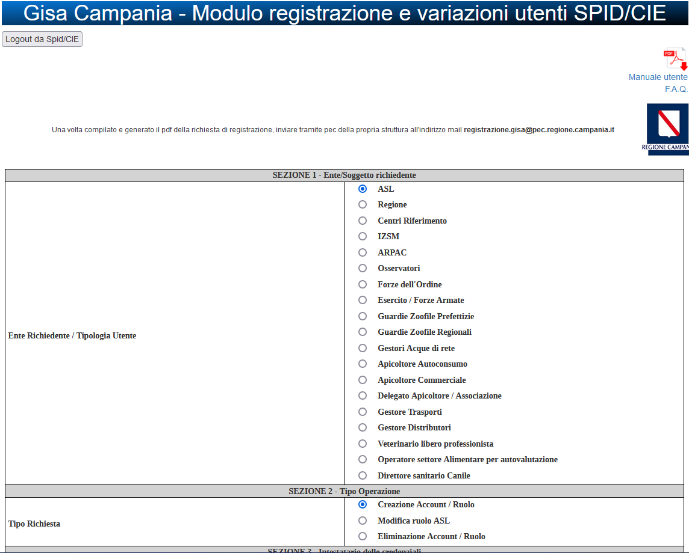
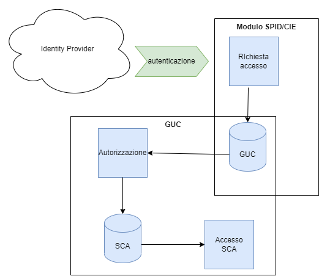

<p align="center">

</p>

# Modulo SPID/CIE 

- [1. Descrizione e finalità del software](#1-descrizione-e-finalità-del-software)
  - [1.1 Descrizione della struttura repository](#11-descrizione-della-struttura-repository)
  - [1.2 Contesto di utilizzo e casi d’uso](#12-contesto-di-utilizzo-e-casi-duso)
  - [1.3 Piattaforme abilitanti](#13-piattaforme-abilitanti)
  - [1.4 Interoperabilità con i sistemi interni](#14-interoperabilità-con-i-sistemi-interni)
  - [1.5 Link a pagine istituzionali relative al progetto](#15-link-a-pagine-istituzionali-relative-al-progetto)
  - [1.6 Interfaccia web](#16-interfaccia-web)
- [2. Architettura del software](#2-architettura-del-software)
- [3. Requisiti](#3-requisiti)
  - [3.1 Tecnologie utilizzate lato server](#31-tecnologie-utilizzate-lato-server)
  - [3.2 Tecnologie utilizzate lato client](#32-tecnologie-utilizzate-lato-client)
- [4. Riuso ed installazione](#4-riuso-ed-installazione)
  - [4.1 Riuso nell’ambito della stessa regione](#41-riuso-nellambito-della-stessa-regione)
  - [4.2 Riuso per enti di altre regioni](#42-riuso-per-enti-di-altre-regioni)
  - [4.3 Librerie esterne](#43-librerie-esterne)
  - [4.4 Creazione e import database](#44-creazione-e-import-database)
  - [4.5 Templates configurazione](#45-templates-configurazione)
  - [4.6 Installazione in un ambiente di sviluppo](#46-Installazione-in-un-ambiente-di-sviluppo)
  - [4.7 Installazione in un ambiente di produzione](#47-installazione-ambiente-di-produzione)
- [5. Configurazione](#5-configurazione)
  - [5.1 Configurazione common/config.php](#51-configurazione-commonconfigphp)
- [6. Licenza](#6-licenza)
  - [6.1 Modulo SPID/CIE](#61-modulo-spidcie)
  - [6.2 Indirizzo e-mail segnalazioni di sicurezza](#62-indirizzo-e-mail-segnalazioni-di-sicurezza)
  - [6.3 Titolarità: Regione Campania](#63-titolarità-regione-campania)

# **1. Descrizione e finalità del software**

Applicativo che consente di inviare richieste di registrazione al proprio Ecosistema Gisa accedendo con i propri dati anagrafici.
Gli utenti che ne fanno richiesta e approvati potranno accedere nei sistemi richiesti attraverso le credenziali SPID/CIE (Sistema Pubblico di Identità Digitale / Carta d'identità elettronica).

Per tutto l’Ecosistema GISA, fatta eccezione dell’accesso come ospite al sistema di autovalutazione, è prevista una fase di pre-registrazione e registrazione che consente la profilazione dell’utente e lo autorizza all’accesso al sistema dopo l’autenticazione con SPID/CIE.
Di seguito il dettaglio:

1. FASE DI PRE-REGISTRAZIONE: l’utente compila il modulo disponibile on-line
	
2. FASE DI REGISTRAZIONE: consiste nella validazione e autorizzazione della richiesta pervenuta da parte del soggetto responsabile dell’utente richiedente che dovrà inviare una mail alla PEC: registrazione.gisa@pec.regione.campania.it
	
Per l’accesso autorizzato e autenticato all’Ecosistema sono necessari i componenti **SCA** e **GUC**.
L’utente può accedere ai vari sistemi solo tramite **SPID/CIE** e solo se autorizzato.

## **1.1 Descrizione della struttura repository**

  - _./database_   script sql per la creazione della struttura del DB 

  - _./docs_       documentazione varia (cartella contenente file integrati nel readme: immagini, diagrammi, ecc.) 

  - _./templates_   file template per la configurazione del sistema

  - _./spid_    sorgenti e struttura di cartelle della piattaforma 


## **1.2 Contesto di utilizzo e casi d’uso**

 Il contesto di utilizzo e casi d'uso del software sono descritti dettagliatamente nella [guida utente](http://www.gisacampania.it/docs_ufficiali/Manuale_ModuloSPID.pdf)
 
 
 ## **1.3 Piattaforme abilitanti**

Le piattaforme abilitanti sono:
    - **Autenticazione SPID/CIE**

## **1.4 Interoperabilità con i sistemi interni**
 
-G.I.S.A

-VAM

-Anagrafe Animali da compagnia

-SCA

-GUC

-Matrix/Cruscotto di reportistica avanzata
 
 
 
 La cooperazione applicativa interna all’ecosistema ***GISA*** avviene invece mediante ***microservices*** o ***DBI*** (***DataBase Interface***).


## **1.5 Link a pagine istituzionali relative al progetto**

- [sca.gisacampania.it](https://sca.gisacampania.it)

## **1.6 Interfaccia web**

Il modulo di Registrazione tramite SPID/CIE permette di inoltrare richieste di registrazione all'ecosistema Gisa attraverso un modulo guidato.





Figura 1. Home del Modulo di Registrazione SPID/CIE


# **2. Architettura del software**

L'architettura software cioè l'organizzazione di base del sistema, espressa dalle sue componenti, dalle relazioni tra di loro e con l'ambiente, e i principi che ne guidano il progetto e l'evoluzione è descritto tramite le immagini seguenti:





Figura 2. Architettura dell'applicativo


Rappresentazione del flusso di fruizione: percorso di navigazione e relazioni tra contenuti


Figura 3. Flusso di fruizione


# **3. Requisiti**

## **3.1 Tecnologie utilizzate lato server**

 - [CentOS 7](https://www.centos.org/download/)
 - [Apache HTTP Server 2.4.x](https://httpd.apache.org/) 
 - [Postgres  12.x ](https://computingforgeeks.com/how-to-install-postgresql-12-on-centos-7/)
 - [git](https://git-scm.com/downloads)
 - [PHP server 5.6.x] (https://www.php.net/releases/5_6_0.php)
 
## **3.2 Tecnologie utilizzate lato client** 

- [Windows](https://www.microsoft.com/it-it/software-download/) (dalla versione 10 in poi)
- [Mozilla Firefox 99.0.1](https://www.mozilla.org/it/firefox/new/) (Browser Certificato)


# **4. Riuso ed installazione**

 
## **4.1 Riuso nell’ambito della stessa regione**

Nell’ottica del risparmio e della razionalizzazione delle risorse è opportuno che gli enti che insistono sullo stesso territorio regionale utilizzino la modalità **Multi-Tenant** al fine di installare un unico sistema a livello regionale.


## **4.2 Riuso per enti di altre regioni**

Al fine di avvalersi dei benefici del riuso così come concepito dal **CAD** si chiede di notificarlo come indicato nel paragrafo 6.3 al fine di evitare sprechi e frammentazioni.

*Nota: Se lo scopo è avviare un processo di sviluppo per modificare la propria versione di SPID, potrebbe essere il caso di generare prima un proprio fork su GitHub e quindi clonarlo.*

Eseguire il seguente comando:

        git clone \
		  --depth 1  \
		  --filter=blob:none  \
		  --sparse \
		  https://github.com/regione-campania/GISA \
		;
		cd GISA
		git sparse-checkout set modulo_spid_cie

Sarà creata la directory modulo_spid_cie. Da qui in avanti si farà riferimento a questa directory chiamandola "directory base".


## **4.3 Librerie esterne**

Come tutte le applicazioni complesse Modulo Spid utilizza un elevato numero di librerie, in buona parte autocontenute a livello di repository.

Queste le librerie referenziate dal client al repository cloud del produttore:

- [d3.v4.min.js](https://d3js.org/d3.v4.min.js)
- [jquery-3.6.0.min.js](https://code.jquery.com/jquery-3.6.0.min.js)
- [jquery-ui.js](https://code.jquery.com/ui/1.13.0/jquery-ui.js)


Libreria autocontenuta:

- [html2pdf.bundle.9.js]


Questi invece i moduli php necessari:

- php-mcrypt 
- php-cli 
- php-gd 
- php-curl  
- php-ldap 
- php-zip 
- php-fileinfo 
- php-mbstring 
- php-json 
- php-pgsql 
- php-xml


## **4.4 Creazione e import database**

Assicurarsi che nel file di configurazione pg_hba.conf sia correttamente configurato l'accesso dell'IP del nodo Tomcat al database: 
```
 host         all         all       <ipapplicativo>       trust
```
```
systemctl reload postgresql-12.service
```


Creazione database e import dello schema tramite i seguenti comandi:

```
psql -U <dbuser> -h <dbhost> -c "create database guc"
```
```
psql -U <dbuser> -h <dbhost> -d guc < database/guc_db.sql
```

con _dbuser_ e _dbhost_ adeguatamente valorizzati

 
## **4.5 Templates configurazione**
Sotto la directory _./templates_ è presente il file template _./templates/config.php_ , da configurare e inserire sotto la directory _./modulo_spid_cie/spid/common/_


## **4.6 Installazione in un ambiente di sviluppo**

- Installare _Visual_ _Studio_ _Code_ Disponibile al seguente indirizzo: https://code.visualstudio.com/

oppure

- Installare _Notepad++_ Disponibile al seguente indirizzo: https://notepad-plus-plus.org/downloads/

- Le istruzioni per l'installazione di un ambiente di Sviluppo sono le stesse della procedura di installazione ambiente di produzione.


## **4.7 Installazione ambiente di produzione**

Prerequisiti 

- Clonare il repository MODULO SPID/CIE  (Vedi paragrafo: 4.2 Riuso per enti di altre regioni) :

	git clone \
		  --depth 1  \
		  --filter=blob:none  \
		  --sparse \
		  https://github.com/regione-campania/GISA \
		;
		cd GISA
		git sparse-checkout set modulo_spid_cie
		
- Installare le librerie esterne ed i moduli php necessari (Vedi paragrafo: Librerie esterne)

- Creare ed importare database (Vedi paragrafo: Creazione e import database )

- Configurare i templates (Vedi paragrafo: Templates configurazione)


Installazione:

- Per l'installazione di PHP 5.6 su CentOS è consigliabile seguire la guida presente in questo link:
	https://www.tecmint.com/install-php-5-6-on-centos-7/

- Installazione Moduli PHP necessari:

```
yum install php php-mcrypt php-cli php-gd php-curl  php-ldap php-zip php-fileinfo php-mbstring php-json php-pgsql php-xml

```
 
A partire dalla directory base spostare la cartella _spid_  sotto la directory /var/www/html/ 


- Disabilitare SElinux con i seguenti passaggi: 

```
vi /etc/selinux/config
```

Settare SELINUX=disabled

```
SELINUX=disabled
```
Riavviare linux

```
reboot
```
Per controllare che SElinux si è disabilitato correttamente eseguire:
```
sestatus
```


 
 
# **5. Configurazione**

## **5.1 Configurazione common/config.php**

- Configurare il file common/config.php copiato dalla cartella template settando i parametri di connessione al db guc;


Una volta avviato Apache HTTP Server provare ad accedere agli applicativi tramite browser Firefox attraverso la url:

```

http://<miosito>:<porta>/spid/
```


# **6. Licenza**


## 6.1 **Modulo SPID/CIE**


Stato Software : Stabile

Browser certificato : Mozilla Firefox 99.0.1

**Soggetti incaricati del mantenimento del progetto open source**

U.S. s.r.l. 
## **6.2 Indirizzo e-mail segnalazioni di sicurezza**
Ogni segnalazione di eventuali problemi di sicurezza o bug relativo al software presente in questo repository, va segnalato unicamente tramite e-mail agli indirizzi presente nel file security.txt disponibile a questo [link](http://www.gisacampania.it/.well-known/security.txt)

NOTA: Le segnalazioni non vanno inviate attraverso l’issue tracker pubblico ma devono essere inviate confidenzialmente agli indirizzi e-mail presenti nel security.txt.

Lo strumento issue tracker può essere utilizzato per le richieste di modifiche necessarie per implementare nuove funzionalità.

## **6.3 Titolarità: [Regione Campania](http://www.regione.campania.it/)**
Concesso in licenza a norma di: **AGPL versione 3**;

E' possibile utilizzare l'opera unicamente nel rispetto della Licenza.

Una copia della Licenza è disponibile al seguente indirizzo: <https://www.gnu.org/licenses/agpl-3.0.txt>

**NOTE:**

In caso di riuso, in toto o in parte, dell’ecosistema software G.I.S.A., è necessario notificare l’adozione in riuso tramite l’apertura di un ticket (o analogo meccanismo quale una pull request) in questo repository. Inoltre, al contempo per gli aspetti organizzativi utili a potenziare i benefici derivanti dalla pratica del riuso tra PP.AA., come la partecipazione alla **Cabina di regia** per la condivisione di eventuali modifiche/integrazioni o innovazioni, è necessario darne tempestiva comunicazione alle seguenti e-mail:

[paolo.sarnelli@regione.campania.it]() 

[cinzia.matonti@regione.campania.it]()	

Gli enti che aderiscono al riuso di GISA entreranno a far parte della Cabina di Regia per condividere e partecipare all’evoluzione di GISA insieme alle altre PP.AA.